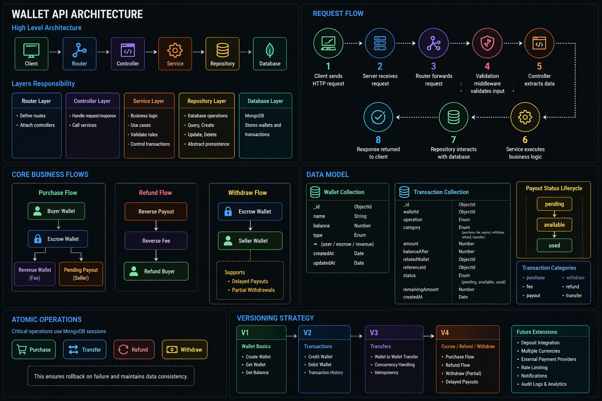

# Wallet API

A RESTful backend service for managing wallets, balances, transactions, and marketplace payment flows.

## Features

- Create wallet
- Get wallet details
- Get wallet balance
- Credit / Debit wallet
- Transfer between wallets
- Purchase flow
- Refund flow
- Delayed payouts
- Partial withdrawals
- Transaction history with pagination
- Filtering / Sorting / Field Limiting
- Rate limiting

---

## Architecture

The project follows layered architecture:

Client → Router → Controller → Service → Repository → Database

### Architecture Diagram



---

## Core Business Flows

### Purchase Flow
Buyer → Escrow  
Escrow → Revenue (Fee)  
Escrow → Pending Payout  

### Refund Flow
Reverse Payout  
Reverse Fee  
Refund Buyer  

### Withdraw Flow
Escrow → Seller  

Supports delayed payouts and partial withdrawals.

---

## Tech Stack

- Node.js
- Express.js
- MongoDB
- Mongoose

---

## Folder Structure

```text
wallet-api/
├── docs/
├── scripts/
│   └── migrate-transaction-operation.js
│
├── src/
│   ├── config/
│   │
│   ├── core/
│   │   ├── middleware/
│   │   │   ├── GlobalError.js
│   │   │   └── rateLimit.js
│   │   │
│   │   └── utils/
│   │       ├── apiFeatures.js
│   │       ├── AppError.js
│   │       └── catchAsync.js
│   │
│   ├── modules/
│   │   ├── transaction/
│   │   │   ├── transaction.model.js
│   │   │   └── transaction.repository.js
│   │   │
│   │   └── wallet/
│   │       ├── wallet.model.js
│   │       ├── wallet.repository.js
│   │       ├── wallet.service.js
│   │       ├── wallet.controller.js
│   │       ├── wallet.validation.js
│   │       └── wallet.router.js
│   │
│   ├── app.js
│   └── server.js
│
└── package.json

```
---

## API Endpoints

### Wallet
- POST /api/wallet
- GET /api/wallet
- GET /api/wallet/:id
- GET /api/wallet/:id/balance

### Transactions
- PATCH /api/wallet/:id/credit
- PATCH /api/wallet/:id/debit
- GET /api/wallet/:id/transactions

### Transfer
- POST /api/wallet/:id/transfer

### Marketplace
- POST /api/wallet/purchase
- POST /api/wallet/refund
- GET /api/wallet/:id/payouts-status
- POST /api/wallet/:id/withdraw

---

## Postman Collection

You can test the API using the Postman collection:

[Wallet API Postman Collection](docs/postman/wallet-api-postman-collection.json)

---

## Security Features

- Rate Limiting
- MongoDB Sessions / Transactions
- Atomic operations
- Global Error Handling

---

## Future Improvements

- JWT Authentication
- External payment integration
- Notifications
- Analytics